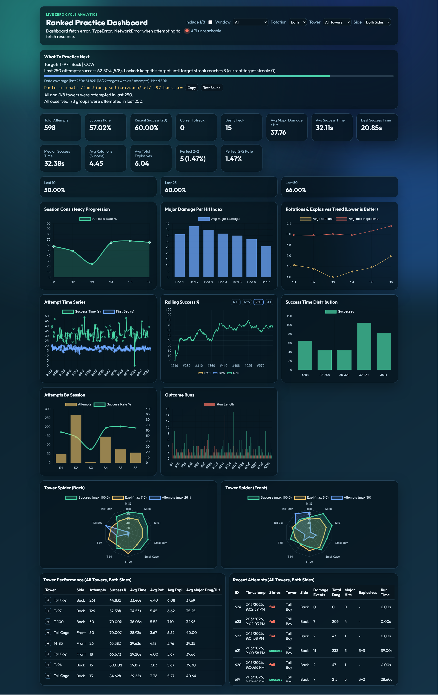

# Zero Cycle Dashboard

Local dashboard for Minecraft Meescht map zero-cycle practice.

It tails `latest.log`, parses runs, and serves a live-updating web UI with tower/side/rotation-focused analytics and practice recommendations.



## Download

1. Click the green `Code` button on the top of this github page.
2. Click `Download ZIP` in the dropdown.
3. Extract the ZIP to a folder.
4. Run future commands from a command prompt  in that folder ( for windows users:  in windows explorer, shift+rightclick in  an empty space in the folder => open in Terminal, for linux users: you should be tech savvy enough )

## Features
- Live log ingestion from Minecraft `latest.log`
- SQLite storage for raw log events and parsed attempts
- Session-aware analytics and rolling consistency charts
- Tower/side/rotation breakdowns with drill-downs
- "What to practice next" target selection with command copy support
- Datapack command integration (`/function practice:zdash/...`)

## Requirements
- Python 3.11+ (3.13 tested)
- Windows PowerShell or Command Prompt
- Access to your Minecraft log file

## Setup
```powershell
python -m pip install -r requirements.txt
```
Override the Zero datapack in your meescht practice map with the one in this repo

## Run
```powershell
python run_dashboard.py
```

Open `http://127.0.0.1:8000`.

`run_dashboard.py` starts Uvicorn and opens a browser. `Ctrl+C` shuts both down.

## Configuration
Primary config file:
- `config.py` at repo root

You can edit defaults there directly (`DEFAULT_LOG_PATH`, `POLL_SECONDS`, etc.), or override with environment variables.

Environment variables:
- `ZERO_DASH_LOG_PATH`: Minecraft log path  
  Default: `C:\Users\Boyen\Desktop\MultiMC\instances\Ranked\.minecraft\logs\latest.log`
- `ZERO_DASH_DB_PATH`: SQLite DB path  
  Default: `data/zero_cycles.db`
- `ZERO_DASH_POLL_SECONDS`: log polling interval  
  Default: `0.4`
- `ZERO_DASH_MAJOR_DAMAGE_THRESHOLD`: threshold for major damage hit classification  
  Default: `15`
