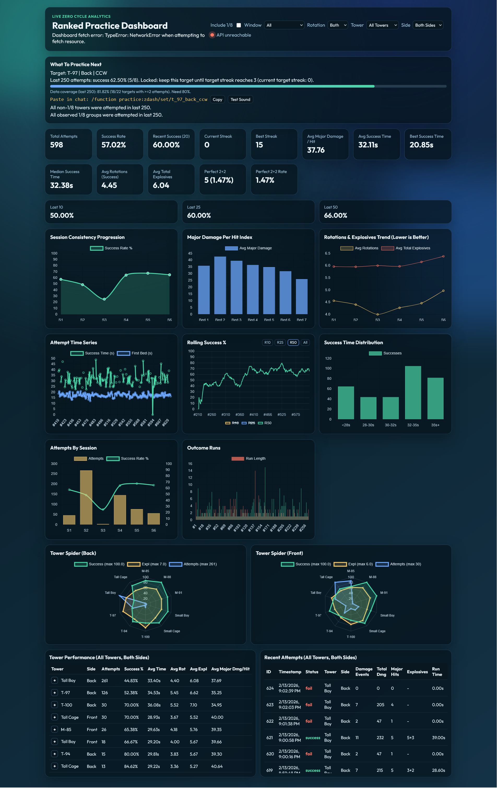

# Zero Practice Dashboard

Local web dashboard for tracking **real MPK zero-cycle runs** over time.

It watches your configured Minecraft instance, ingests run data into SQLite, and gives live analytics + practice targeting.



## What It Does
- Continuously reads your instance `latest.log`
- Parses run outcomes (success/fail/flyaway), tower/side/rotation, O-level, standing Y, explosions, shots, and damage splits
- Stores both raw log history and parsed attempts in `data/zero_cycles.db`
- Shows live charts, recent attempts, and a tower x O-level heatmap
- Recommends what to practice next and can drive set-seed practice automatically
- Tracks stronghold navigation raw path (Eye Spy -> End entry) in storage + SQLite for later room analysis

## Injection / Runtime Behavior
The app can inject helper components into your selected instance, with backups and restore on uninject/shutdown.

- Always injects: `zdash_tracker` datapack
- Optional: altered Atum jar (set-seed injection), recipe-book jar, dragon-node patch jar
- Supports **Full Random override** (no forced seed injection)
- Supports **Legal Ranked Instance** mode:
  - Forces full random
  - Disables recipe-book + dragon patch jars
  - Skips Atum injection (no set-seed injection)
  - Still injects datapack

## Quick Start (Windows)
1. Download ZIP: click green `Code` -> `Download ZIP`, then extract.
2. Open terminal in the extracted folder.
3. Install deps:
```powershell
py -3 -m pip install -r requirements.txt
```
4. Run:
```powershell
py -3 run_dashboard.py
```
5. Open `http://127.0.0.1:8000`

Alternative: run `run_zero_tracker.bat` to auto-clone/update, install requirements, and start.

## First-Time Setup In UI
1. Enter your MultiMC instance path (.minecraft folder).
2. Choose toggles (or Legal Ranked mode).
3. Click `Save & Inject`.
4. Use `Uninject + Clear Path` to restore and clear config. ( will also happen on application exit )

## Data + Config
- Database: `data/zero_cycles.db`
- App config defaults: `config.py`
- Main runtime path is stored in DB (`setup.mpk_instance_path`)

## Stronghold Nav Analysis (Prototype)
This repo now includes a seed-based stronghold room/path cracker for 1.16.1.

1. Ensure your datapack-injected run contains Eye Spy and End entry data.
2. Run:
```powershell
py -3 scripts/analyze_stronghold_world.py "C:\path\to\world"
```
Optional: also write `rooms_entered` + starter dwell back into latest DB attempt for that world:
```powershell
py -3 scripts/analyze_stronghold_world.py "C:\path\to\world" --update-db
```
3. Output map JSON is written to:
- `<world>\data\zdash_stronghold_map.json`

Raw stronghold samples are also stored in DB table:
- `stronghold_samples` (linked to `attempts.id`)

Auto-watch latest world on exit (no manual world-name lookup):
```powershell
py -3 scripts/watch_stronghold_analyze.py --instance "C:\Users\Boyen\Desktop\MultiMC\instances\Ranked\.minecraft"
```
